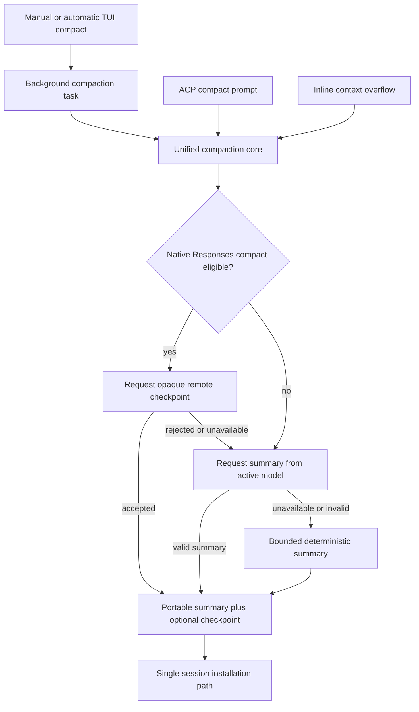
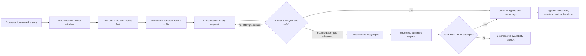
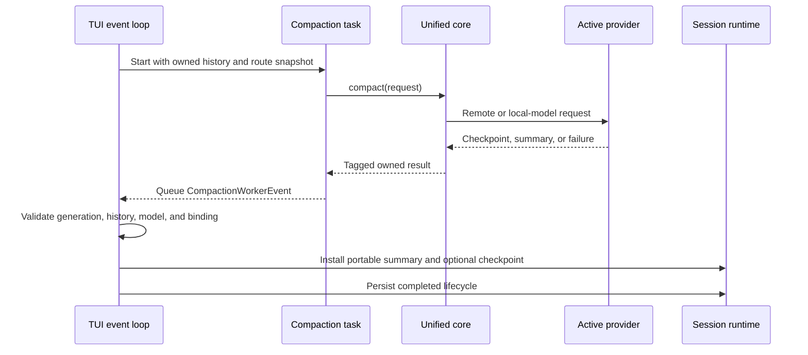

# Unified context compaction

fx has one semantic compaction strategy owner. Manual `/compact`, automatic
threshold compaction, context-overflow recovery, TUI, and ACP all delegate to
`src/core/agent/runtime/compaction.zig`. Session code owns persistence and
active-context boundaries, but it does not choose providers or implement a
second fallback ladder.

This design combines two useful properties:

- Responses-native providers can preserve an opaque provider checkpoint.
- Every other provider can use its active model to create a portable,
  structured full-replacement summary.

## Strategy and ownership

The unified core returns one owned result with a strategy tag:

| Strategy | Portable summary | Opaque checkpoint | Intended use |
| --- | --- | --- | --- |
| `remote` | Yes | Yes | Responses route accepted native compaction |
| `local_model` | Yes | No | Active model produced a valid replacement |
| `local_fallback` | Yes | No | Model compaction could not complete safely |

Callers install the result. They never retry a different strategy themselves.
This keeps remote eligibility, local retries, summary validation, cancellation,
usage accounting, and final fallback in one place.

## Local model full replacement

Local model compaction is transport-agnostic. It reuses the active provider,
credential, endpoint, model, model capabilities, retry policy, usage ledger,
and cancellation flag. Tool choice is forced to `none`, so compaction cannot
start agent work.

The embedded prompt asks for a continuation handoff organized around request
lineage, completed work, decisions, evidence, current state, constraints,
remaining work, and the next action. Exact identifiers, paths, commands,
errors, and user requirements are retained when they affect continuation.
Previous summaries are treated as authoritative history rather than rewritten
speculatively. The prompt forbids copying transient skill bodies,
capability-discovery output, and prompt instructions. Deterministic
projections and continuation anchors also hard-omit those tool bodies, and the
cleaner removes echoed skill-content blocks. The handoff records the named
capability and relevant outcome so current context can be loaded again from its
owner.

The fitted stage estimates the active model's effective input budget, trims
large tool outputs first, and then keeps a coherent recent suffix. A
request-too-large response advances directly to the lossy stage. Missing,
degenerate, or unsafe summaries are retried at most three times per stage.
The lossy stage feeds the same model the bounded deterministic projection. If
the model still cannot provide a valid summary, that projection becomes the
installed result, so compaction remains available without another provider.

## Native Responses checkpoint

Remote compaction is attempted only when the credential resolves to an
OpenAI Responses route whose contract advertises native compaction. The request
uses the captured provider binding when the caller has one; otherwise the core
builds the binding from the exact Responses endpoint and active credential.
Large tool results may be replaced before transport when the estimated request
would exceed the model threshold.

A successful remote result contains both:

- The provider's opaque replacement JSON, wire model, and identity binding.
- A portable deterministic summary that can survive a later provider change.

The opaque checkpoint is replayed only when credential source, normalized
endpoint, account or key identity, organization, project, and wire model still
match. A binding change never redirects provider-owned context to a different
identity.

## TUI lifecycle and thread boundary

The TUI never performs provider compaction on its event loop. It snapshots the
session history and route, starts one owned background task, and keeps the
composer available. Input submitted during compaction remains queued for the
next turn.

The worker callback only queues an owned event. Transcript notices and session
mutation happen during UI-thread event drain. Results are discarded if their
session, history generation, model, source, or provider binding no longer
matches the captured task. Cancellation joins the task before its route or
session storage is released.

## Persistence and projections

Installation appends one compacted-summary turn to canonical history and moves
the active context boundary to it. Older canonical turns remain available for
durable session history, while future model requests see the replacement plus
new turns. Remote metadata is optional and is copied atomically with the same
summary.

Semantic compaction takes an unprojected snapshot of every canonical turn in
the active context. The ordinary request path may still use its configured
turn-window projection, but that lossy prompt optimization is never used as the
source for a full replacement or for removed-turn accounting.

The bounded turn-window snapshot is intentionally network-free. It calls the
same deterministic summary primitive from the unified compaction module, while
session code supplies only history-to-message projection and metadata counts.
An active opaque checkpoint and its suffix remain an atomic replay chain until
a later successful semantic compaction replaces them.

## Failure semantics

| Condition | Behavior |
| --- | --- |
| Remote route unsupported | Record the skip reason, then continue with active-model compaction |
| Remote request rejected or transport unavailable | Record the attempt, then continue locally |
| Local transport or retryable provider failure | Retry up to three times in the current stage, then try the lossy stage |
| Local input too large or rejected as invalid | Retry with bounded lossy input |
| Local summary empty, too short, or unsafe | Retry up to three times in the current stage |
| Local model unavailable after both stages | Install the deterministic fallback and show the recorded failure reason |
| Cancellation | Return cancellation without installing a result |
| TUI state or provider changed before completion | Discard the stale result without mutating context |
| Installation or persistence failed | Keep the failure visible and do not report successful compaction |

Every local and remote failure is written to `~/.fx/logs/trace.log` and, when a
session id is present, to that session's `logs/compaction.log`. The TUI, ACP, and
inline overflow notices reuse the same recorded reason so a fallback is never
described only as "the active model was unavailable."

Every provider attempt records usage through the ordinary durable usage path.
A successful remote request records its direct response usage. Local model
attempts use the same stream accounting as ordinary model completions. The UI
does not synthesize usage after the fact.

## Code Index

- `src/core/agent/runtime/compaction.zig:150`: the only strategy selector.
- `src/core/agent/runtime/compaction.zig:329`: local model fitting, retries, and
  validation.
- `src/core/agent/runtime/compaction.zig:854`: bounded deterministic fallback
  shared with turn-window projection.
- `src/core/agent/runtime/compaction.zig:932`: transient skill and discovery
  tool-body exclusion.
- `src/core/agent/runtime/compaction_prompt.md:1`: structured local
  continuation prompt.
- `src/core/app/app_session_runtime.zig:1148`: owned asynchronous TUI task.
- `src/core/app/app_session_runtime.zig:3349`: stale-result validation and
  UI-thread installation.
- `src/core/session/session.zig:1928`: unprojected semantic compaction snapshot.
- `src/core/session/session.zig:2067`: atomic portable summary and optional
  checkpoint installation.
- `src/core/session/session.zig:3341`: network-free turn-window projection.
- `src/acp/prompt.zig:484`: ACP `/compact` entrypoint.
- `src/core/agent/runtime/orchestrator.zig:2967`: inline threshold and
  context-overflow entrypoint.
- `src/core/gateway/responses_compaction_binding.zig:30`: opaque checkpoint
  route and identity binding.
- `src/core/shared/types.zig:181`: strategy and cross-thread worker event
  contracts.

## Verification focus

Focused tests protect remote precedence, provider binding, tool-output trimming,
remote rejection followed by local-model compaction, Grok local compaction,
degenerate-summary retries, deterministic fallback, atomic session install,
stale background result rejection, and the queued UI-thread event boundary.
End-to-end verification should exercise `/compact` through both ACP and a live
TUI using the freshly built `./zig-out/bin/fx`.
