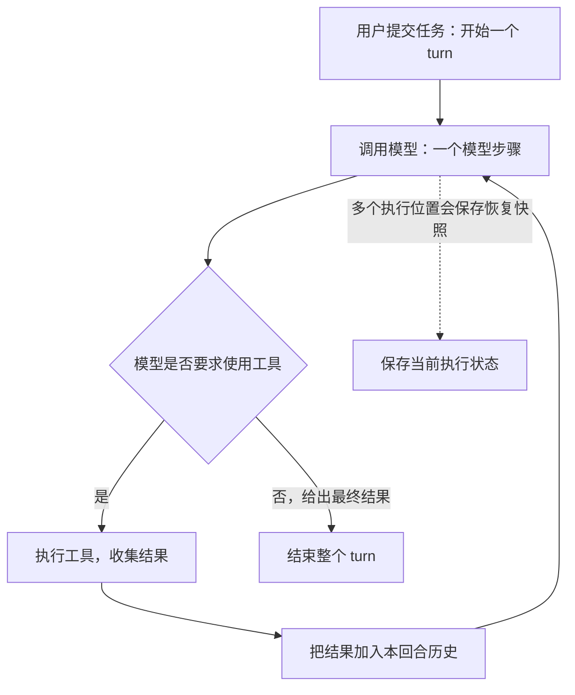
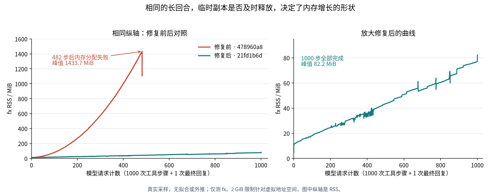

# 十几 MB 的会话，如何撑爆几十 GB 内存：一次 fx OOM 复盘

一次接近完成的开发任务，最后让我的 Ubuntu 环境陷入了内存耗尽。

任务本身并不特殊：让 fx 这个命令行编程助手完成 Gateway BYOK 配置功能。早期它检查源码、修改代码，随后执行了测试和构建。但任务没有正常收尾，助手开始反复检查分支、diff、历史任务和目录。几个小时后，Linux OOM killer 杀掉了 fx，其他服务也陆续出现故障。

最令人困惑的是：恢复出来的完整快照只有约 **13.2 MiB**，fx 当时却占用了约 **35.3 GiB 常驻匿名内存和 8.1 GiB swap**。

这篇文章沿着三个问题展开：这些内存从哪里来，为什么代码里有清理操作仍然会出问题，以及怎样证明修复有效。读者不需要有 Zig 基础；理解 Rust 的所有权，或 C++ 的对象生命周期和内存分配，就足够读下去。

> 版本与证据：事故发生于 2026-09-05，时间线使用 UTC+8。事故时的工作基线是 `82da0340`，现场还存在未提交修改。本文用上游 `478960a8` 与修复提交 `21fd1b6d` 做可重复对照，修复见 [PR #687](https://github.com/vercel-labs/fx/pull/687)。对照实验能验证内存缺陷和修复效果，但不能替代事故时并不存在的堆快照。

## 一、先确认：确实是 fx 把内存耗尽了

当时宿主机约有 64 GB 内存，Ubuntu 环境的内存配置上限为 40 GB，另有约 10 GiB swap。宿主机的总内存，并不等于这个环境或 fx 进程可以独占的内存。

11:52:12 的内核记录给出了明确证据，关键字段如下：

```text
Free swap = 0kB
Total swap = 10485760kB
Out of memory: Killed process 174293 (fx)
anon-rss:36964228kB
```

OOM 进程表还记录了 fx 的 2,135,616 个 swap 页。按每页 4 KiB 换算：

| 项目 | 换算结果 |
| --- | ---: |
| 常驻匿名内存 | 36,964,228 KiB，约 35.3 GiB |
| 已换出的内存 | 2,135,616 × 4 KiB，约 8.1 GiB |
| 两者合计 | 约 43.4 GiB |

这里要先分清三个量。**RSS** 是当前驻留在物理内存中的部分；这里的 `anon-rss` 更具体，指匿名内存的常驻部分。**swap** 记录被换到交换空间中的部分，不包含在这份常驻匿名内存数字里。**虚拟地址空间** 则还包括预留和映射等内容，不能直接当成物理内存占用。

内核已经明确记录了 swap 耗尽和 fx 被 OOM killer 杀死。因此，这次调查的起点是 fx 自身的内存增长，而不是根据宿主机还有多少内存猜测是否发生过 OOM。

恢复出来的执行记录，把事故前的过程串了起来：

| 时间 | 发生的事情 |
| --- | --- |
| 06:17 起 | 正常检查源码并实现功能 |
| 07:35–07:38 | 执行测试、构建和 CLI 检查 |
| 07:38:44 起 | 开始大量重复检查分支、diff、历史任务和目录 |
| 11:23:22 | 最后一条命令仍在做同类检查 |
| 11:28:13 | 最后一份恢复快照写入事件日志 |
| 11:52:12 | 内核杀掉 fx |

最后一份完整恢复状态包含 **1,171 个工具步骤、3,735 次工具调用、1,473 条文件证据记录**。工具调用 ID 都不重复，说明调用确实发生过；但新的调用 ID，并不意味着获取了新的信息。

当时完整快照为 13,850,650 字节，约 13.2 MiB。工具输出合计约 7.8 MB，命令日志文件合计约 13.6 MB。这些数字描述的是保留下来的数据及其磁盘表示，彼此还可能包含相同内容，不能相加后直接解释进程的堆占用。

取证时也不能只读 `session.json`：它的提交进度落后于事件日志末尾。部分时间字段会在恢复重建时重新填写，需要结合命令 artifact 名称和文件时间还原顺序。日志中的 `network_interrupted` 不能单独证明反复断网；`compaction` 事件也可能来自超大恢复快照的持久化回退，并不等于模型上下文已经成功压缩。

这些证据首先回答了“发生过什么”。要解释为什么会消耗几十 GiB，还得进入内存生命周期。

## 二、一个用户任务里，可能藏着上千次请求

对编程助手来说，用户说一句“完成这个功能”，通常不会只对应一次模型调用。



这张图中有三个不同的生命周期：

| 生命周期 | 例子 | 通常何时结束 |
| --- | --- | --- |
| 用户回合，代码里称为 turn | “把这个功能完成” | 整个任务完成、取消或停止时 |
| 模型步骤 | 模型决定读取几个文件 | 这一轮响应及相关处理结束时 |
| 请求尝试 | 一次 HTTP 请求，或一次重试 | 该次请求成功、失败或取消时 |

一条“读取文件成功”的工具结果，只意味着一次工具调用结束了。模型下一轮还要依据它继续工作，所以这个结果可能需要活到整个用户回合结束。

但为了把历史保存到磁盘而临时拼出来的结构，只需要活到这次保存完成。HTTP 响应解析时创建的中间对象，也通常只需要活到这次请求处理结束。

**这次缺陷的核心，就是把这些用途不同的数据，放进了同一个过长的生命周期。**

## 三、用 Rust/C++ 的概念理解 Zig 的 arena

先认识本文会用到的几种 Zig 写法：

| Zig 写法 | 对 Rust/C++ 开发者的解释 |
| --- | --- |
| `[]u8`、`[]const u8` | 带长度的字节切片，可以类比 `&mut [u8]`、`&[u8]` 或 `std::span`；类型本身不表示谁负责释放 |
| `Allocator` | 一组分配、调整大小、释放操作的接口；具体回收策略取决于它背后的分配器 |
| `ArenaAllocator` | 从底层分配器取得内存块，在其中分配对象，并支持集中回收 |
| `deinit()` | 普通的清理方法，需要代码显式调用；不会仅因局部变量离开作用域而自动执行 |
| `defer cleanup()` | 离开当前作用域时调用清理，包含普通返回和错误返回；同一作用域按登记的逆序执行 |
| `try operation()` | 成功时取值，出错时向外返回，作用类似 Rust 的 `?` |
| `errdefer cleanup()` | 只有当前作用域以错误返回时才执行，适合清理构造到一半的对象 |

语言细节可查阅 [Zig 0.16 的切片、defer 和错误处理说明](https://ziglang.org/documentation/0.16.0/#defer)。与 Rust 借用不同，Zig 的切片不会通过借用检查器证明其背后的内存仍然有效；`const` 也不意味着那块内存不会被其他代码释放。

### arena 的局部对象，和它管理的内存，是两回事

fx 在处理整个用户回合时创建 arena，关键代码是：

```zig
var arena_state = std.heap.ArenaAllocator.init(std.heap.c_allocator);
defer arena_state.deinit();
const arena = arena_state.allocator();
```

`arena_state` 是内存池的管理对象，`arena` 是指向这个池的分配器接口。复制这个接口，不会复制整个内存池。

这段代码的意思是：**本作用域结束时，把这个 arena 持有的内存块归还给底层分配器。** 它没有承诺每次模型调用结束就释放内存。这里的作用域覆盖整个用户回合，里面可以经历上千次模型步骤。[修复前的回合入口](https://github.com/vercel-labs/fx/blob/478960a8ab9315507e0a40d4434df71898fadf13/src/core/agent/runtime/orchestrator.zig#L4115-L4117)

如果熟悉 C++17 的 `std::pmr::monotonic_buffer_resource`，可以用下面这段示意代码理解问题：

```cpp
std::pmr::monotonic_buffer_resource turn_pool;

for (/* 每个模型步骤 */) {
    std::pmr::string snapshot{&turn_pool};
    serialize_full_history(history, snapshot);
    persist(snapshot);
} // snapshot 析构了，但 turn_pool 仍然存在
```

字符串对象已经析构，底层内存资源却仍然持有分配过的空间。C++ 标准草案明确规定，`monotonic_buffer_resource::do_deallocate` 不执行回收操作；集中释放发生在 `release()` 或资源析构时。[C++ 内存资源定义](https://eel.is/c++draft/mem.res.monotonic.buffer)

Zig 0.16 的 arena 有一个需要保留的细节：**释放最近的一次分配时，可以尝试回退分配位置；其他位置的单独释放不会回收那块空间。** 因此，也不能笼统地说它的 `free` 永远不起作用。[`ArenaAllocator.free` 源码](https://github.com/ziglang/zig/blob/0.16.0/lib/std/heap/ArenaAllocator.zig#L608)

但只要短命分配和需要长期保留的数据发生交错，就不能依靠这种尾部回退，保证所有旧对象的空间都能复用。

### 有析构或 `defer`，并不保证内存占用合理

Rust 同样可以安全地保留大量已经没有业务价值的数据：

```rust
let mut retained_copies = Vec::new();
for step in steps {
    update_history(&mut history, step);
    retained_copies.push(build_snapshot(&history));
}
```

这段示意代码没有违反所有权规则，但旧快照会一直保留到 `retained_copies` 被释放。fx 并没有显式维护这样的快照列表；这里类比的是结果：arena 仍持有旧副本占用的内存块。

这种问题更准确地说是**超出需要的内存保留**。程序正常结束回合时，arena 可以把内存全部释放，常规退出时的泄漏检查也未必报告问题。但对于一个运行几小时的回合，“结束时再释放”已经太晚了。被 OOM killer 强制杀死时，更不能指望栈上的 `defer` 继续执行。

## 四、真正放大内存的路径：每保存一次，就重新复制历史

恢复快照是有用的。它记录正在执行的任务、已经完成的工具调用和结果，让程序中断后有机会接着工作。

问题出在构建快照的内存从哪里来。修复前的关键路径可以简化为：

```zig
// 简化片段：arena 来自整个用户回合。
const execution = try runtime_execution_memory.buildExecutionMemory(
    arena,
    current_turn_messages,
);
try effect.set(deps.ctx, .{
    // 其他恢复字段省略。
    .execution = execution,
});
```

[`persistRecoveryCheckpoint`](https://github.com/vercel-labs/fx/blob/478960a8ab9315507e0a40d4434df71898fadf13/src/core/agent/runtime/orchestrator.zig#L3264-L3315) 从本回合消息重新构建执行记录。这不只是创建一个指向旧历史的轻量视图。构建过程会复制工具调用信息、参数、结果文本，以及相关证据和展示数据；例如，`redactText` 即使不需要遮盖任何内容，也会在相应路径上复制文本，以得到独立拥有的数据。[执行记录构建代码](https://github.com/vercel-labs/fx/blob/478960a8ab9315507e0a40d4434df71898fadf13/src/core/agent/execution_memory.zig#L15)

而且，**成功的普通模型响应也会进入恢复快照保存路径**。它并不只在网络失败时运行。[成功响应后的保存位置](https://github.com/vercel-labs/fx/blob/478960a8ab9315507e0a40d4434df71898fadf13/src/core/agent/runtime/orchestrator.zig#L6458-L6487)

于是，一段不断增长的历史，被重复完整地构建：

```text
第 1 次保存：复制 [结果 1]
第 2 次保存：复制 [结果 1，结果 2]
第 3 次保存：复制 [结果 1，结果 2，结果 3]
……
第 n 次保存：复制 [结果 1，结果 2，……，结果 n]
```

新一次保存完成后，前几次构建用过的临时副本已经没有用途，但它们分配在整个回合的 arena 中，空间并没有随保存结束而整体释放。

### 为什么只看持久化代码，会漏掉这个问题

保存端实际上做了正确的事情。它复制传入的快照，写入恢复状态，并释放自己持有的上一份快照：

```zig
const checkpoint = try payload.checkpoint.dupe(alloc);
// 写入恢复状态，错误清理逻辑在此省略。
if (self.state.recovery_checkpoint) |*prior| prior.deinit(alloc);
self.state.recovery_checkpoint = checkpoint;
```

这里的 `alloc` 是保存端使用的分配器。它释放的是**保存端持有的旧快照**，没有释放调用方刚才在 turn arena 中构建的那一份临时记录。[保存端的复制与替换](https://github.com/vercel-labs/fx/blob/478960a8ab9315507e0a40d4434df71898fadf13/src/core/session/session_log.zig#L2315-L2335)

因此，磁盘上可以只体现当前恢复状态，保存端也可以只持有一份最新快照，调用方的 arena 却仍然在不断积累旧的构建内存。只检查“旧 checkpoint 有没有被替换”，会漏掉另一层所有权。

### 从线性历史，变成二次累积

用一个刻意简化的模型计算。假设每步增加 `b` 字节历史，每步保存一次，每次重建复制当前全部历史。那么第 `k` 步的历史大小约为：

```text
H(k) = k × b
```

如果每次构建的空间都保留到回合结束，旧临时副本累计占用约为：

```text
S(n) = b + 2b + 3b + … + nb
     = b × n(n + 1) / 2
```

例如，**仅作为数学示例**，假设每步新增 10 KiB，执行 1000 步：当前历史约为 9.77 MiB，反复保留的完整副本合计却约为 4.77 GiB。

这个模型解释了增长形状，不是在还原事故的精确字节数。JSON 大小不等于堆大小，真实路径可能有多次保存、额外结构、分配器容量和请求临时数据。不能拿最后那份 13.2 MiB 快照乘一个系数，就声称已经算清全部 43.4 GiB。

## 五、修复的第一步：给快照构建单独的生命周期

修复保留了整个回合的 arena，因为消息、工具结果和后续处理仍然需要其中的数据。变化发生在保存快照的局部边界：

```zig
var scratch = std.heap.ArenaAllocator.init(std.heap.c_allocator);
defer scratch.deinit();
const arena = scratch.allocator();
const execution = try runtime_execution_memory.buildExecutionMemory(
    arena,
    current_turn_messages,
);
```

这段是[修复提交中的实际代码](https://github.com/vercel-labs/fx/blob/21fd1b6da46608e1339369ec3019c856325ab5a9/src/core/agent/runtime/orchestrator.zig#L3279-L3290)。这里的 `scratch` 表示临时工作区。后面仍然调用保存端，但整个保存函数返回时，这一次重建所用的 arena 就会销毁；保存返回错误时，同样会执行这个 `defer`。


这条边界成立，有一个必须先验证的条件：**保存函数返回之后，保存端不能继续借用 scratch 中的切片。**

调查沿着 TUI 应用层、ACP 协议层和子任务的调用路径检查到保存端，确认相关实现会同步复制或序列化。修复也把这项约定写进了 `RecoveryCheckpointEffect`：需要保留的数据，必须在调用返回前完成复制或序列化。[借用契约](https://github.com/vercel-labs/fx/blob/21fd1b6da46608e1339369ec3019c856325ab5a9/src/core/agent/runtime/deps.zig#L34-L38)

否则，只增加一个局部 arena，就可能把 OOM 换成 use-after-free：调用方释放了内存，后台保存线程还在读它。

### 为什么不用两个更简单的办法

直接重置整个回合 arena，会连同后续还要使用的消息和工具结果一起释放。Zig 的切片没有自动的生命周期保护，这些引用随后可能读到已经失效的内存。

另一种看似局部的修改，是把临时 arena 建在 turn arena 之上。这样销毁临时 arena 时，释放操作又回到了长期 arena，能否回收仍取决于它的分配顺序和策略，不能保证得到独立的释放边界。此次修复使用 `std.heap.c_allocator` 作为临时 arena 的底层分配器，使整批临时内存可以在边界结束时归还。

归还给底层分配器，也不意味着操作系统看到的 RSS 必须立刻下降到原点。底层分配器可能保留空间以供复用。这里要消除的是旧副本随着保存次数不断叠加，而不是要求每次请求结束后进程内存归零。

此外，原代码已经有每个模型步骤会重置的 `overlay_arena_state`。它并不等于回合 arena；存在一个会重置的池，不能证明所有临时数据都分配在那个池里。

## 六、修复的第二步：请求结束后，只把需要保留的结果带出来

继续检查调用链，还发现了第二条生命周期过长的路径：`streamModelCompletion` 把调用方的长期分配器传给 provider，用于请求处理。

Provider 是模型服务适配层，它处理 HTTP、解析响应，并把结果交给 agent。请求完成后需要保留的，通常是正文、工具调用等语义结果；请求解析和传输过程中的临时结构并不需要陪伴整个用户任务。

这些临时对象即使调用了自己的清理方法，当底层是长期 arena 时，也不能保证空间及时回收。需要谨慎区分版本：对照用的上游 `478960a8` 已经把预构建请求体放进会重置的 overlay arena，不能笼统地把所有请求序列化都归到长期 arena。此处修复的是实际传入 provider 的请求处理分配器。

新的做法同样是在请求边界建立 scratch，下面省略了计费、遥测和错误处理细节：

```zig
var scratch = std.heap.ArenaAllocator.init(std.heap.c_allocator);
defer scratch.deinit();
const request_alloc = scratch.allocator();

var result = try provider.stream(request_alloc, request);
defer result.deinit(request_alloc);

// 示意 owned 结果分支：完整复制后，才能销毁请求内存。
return try result.dupe(alloc);
```

实际实现会区分拥有内存的 `owned` 结果，和嵌入式或测试 provider 返回的稳定 `borrowed` 结果；后者保留原契约。[完整请求边界](https://github.com/vercel-labs/fx/blob/21fd1b6da46608e1339369ec3019c856325ab5a9/src/core/agent/runtime/gateway_step.zig#L46-L113)

### 为什么必须深拷贝

假设 provider 返回一个包含切片的结构：

```zig
// 示意结构，不是 fx 的完整定义。
const Response = struct {
    content: []const u8,
};
```

复制 `Response` 本身，只复制了切片的地址和长度，背后的正文仍然在请求 arena 里。请求 arena 一销毁，新结构就带着一个失效的引用。

它很像 C++ 中复制一个 `std::string_view`：复制 view 不会复制字符串。对 Rust 来说，真正跨越这个生命周期边界需要得到拥有数据的值，例如 `Vec<u8>`，而不是把借用留到所有者销毁以后。

因此，修复增加的 `Result.dupe` 不只复制正文，还处理工具调用 ID、工具名称、参数、provider 状态、计费模型名称、延迟用量引用和失败诊断等需要独立持有的字段。[结果复制实现](https://github.com/vercel-labs/fx/blob/21fd1b6da46608e1339369ec3019c856325ab5a9/src/core/agent/stream_provider.zig#L321-L365)

延迟计费引用尤其容易遗漏：它可能借用响应中的 generation ID，也可能借用其他来源的字符串。把整个请求 arena 提前释放后，必须重新说明这些字符串由谁持有、何时释放，不能因为“正文显示正常”就认为复制完整了。

这两项修复没有取消必要的历史保留。它们把“下一步仍会用到的数据”和“这一次处理已经用完的数据”分开了。

## 七、如何证明：内存少了，而任务和历史没有被偷偷删掉

依赖真实模型重演几小时循环，既昂贵，也无法保证每次行为相同。于是验证使用了一个本地 HTTP 服务充当模型，驱动真实构建出的 fx：

1. 每一步修改一个约 1 KiB 的文件，再要求 fx 执行 `read_file`。
2. 每次工具调用使用不同的 ID，文件内容也随步骤变化。
3. 连续完成 1000 次读取后，模型服务返回固定的最终回答。
4. 使用隔离的配置目录和工作目录，不调用真实付费模型。

文件不断变化，是实验设计中的关键。如果靠无进展检测在第几十步就停掉任务，不能算修好了长回合的内存问题。这里要验证的是：一个确实持续产生新证据的任务，能完整执行。

测试只采样 fx 进程的 `/proc/<pid>/status`，每 100 ms 一次。本地模型服务丢弃收到的请求体，不累积保存它们。测试进程设置了 **2 GiB 虚拟地址空间上限、600 秒超时，并禁止 core dump**，避免复现时再次耗尽整个环境。[实验脚本](https://github.com/vercel-labs/fx/blob/21fd1b6da46608e1339369ec3019c856325ab5a9/benchmarks/long_turn_memory.py)

### 同一上游基线上的对照结果

两份二进制分别来自 `478960a8` 和仅包含此次修复的 `21fd1b6d`，均使用 Zig 0.16.0、ReleaseSafe，在同一 Ubuntu x86_64 环境运行同一工作负载。

| 指标 | 修复前 | 修复后 |
| --- | ---: | ---: |
| 目标工具步骤 | 1000 | 1000 |
| 实际成功工具步骤 | 482，随后 `OutOfMemory` | 1000，正常完成 |
| 模型请求数 | 482 | 1001，含最终回复 |
| 采样峰值 RSS | **1433.7 MiB** | **82.2 MiB** |
| 保留的工具输出 | 519,006 字节，约 0.50 MiB | 1,076,893 字节，约 1.03 MiB |
| 当前持久化表示 | 待恢复执行快照约 1.35 MiB | 完成后的会话事件日志约 2.02 MiB |
| 进程退出码 | 1 | 0 |

表格与下图取自[这两轮实验的实际采样数据](assets/long-turn-oom/measurements.json)。数据保留了二进制 SHA-256 和原始数值样本，移除了本机二进制路径。



左图在同一个纵轴上比较内存规模；右图专门放大修复后的曲线，避免把仍然存在的正常历史增长压成一条看不见的线。[SVG 矢量图](assets/long-turn-oom/memory-rss.svg)和[绘图脚本](assets/long-turn-oom/plot_memory.py)也一并保留。

| 模型请求计数 | 修复前 RSS | 修复后 RSS |
| --- | ---: | ---: |
| 100 | 79.84 MiB | 18.12 MiB |
| 200 | 271.17 MiB | 24.37 MiB |
| 300 | 574.22 MiB | 30.79 MiB |
| 400 | 999.31 MiB | 33.07 MiB |
| 480 | 1422.42 MiB | 42.03 MiB |
| 600 | 已因分配失败退出 | 50.78 MiB |
| 800 | 已因分配失败退出 | 60.33 MiB |
| 1000 | 已因分配失败退出 | 76.95 MiB |

这些是请求计数首次到达相应值时的采样，而不是某次请求完成瞬间的精确测量。82.2 MiB 峰值取整段采样的最大值，包含收尾阶段，因此不必等于表中某一个点。100 ms 采样也不能捕获任意瞬时尖峰。

修复后保留了更多工具输出，并且完整执行到第 1000 步。内存增长不再表现为前面那种不断堆积旧副本的曲线。

这个实验还有三个容易读错的地方：

* 受限实验返回的是分配器的 `OutOfMemory`，原事故发生的是内核 OOM kill。它们通过不同方式终止，不能混称为同一次故障。
* 2 GiB 限制针对虚拟地址空间，所以出现分配失败时，RSS 完全可能低于 2 GiB。
* 失败回合和成功回合的持久化格式不同。上游 v4 会把成功完成的历史写成规范化的会话事件；“当前嵌入式恢复快照为空”不等于工具历史丢失。脚本分别测量两种表示，并检查工具调用成功数和最终输出。

两轮运行分别耗时约 50.7 秒和 120.3 秒，但前者没有完成任务，不能用这两个总时长比较速度。此次对照证明的是内存保留行为得到修正，以及目标工作负载能够完成。

### 再用分配器测试检查所有权，而不只看 RSS

RSS 是进程级结果，无法单独告诉我们每一块内存属于谁。修复还配套了几类直接验证生命周期的测试：

| 测试 | 验证的具体性质 |
| --- | --- |
| 1000 次逐步增长的快照保存 | 每次先记录历史已经占用的 turn arena 容量，保存后容量应与保存前相等；下一步追加历史本身允许增长 |
| 保存端保留快照、随后再次保存失败 | 临时 arena 销毁后，保存端的数据仍可读取；新保存失败不破坏旧状态 |
| 1000 次 provider 尝试 | 交替覆盖成功、服务端失败、传输失败和取消，请求 scratch 不应累积到调用方的 arena |
| 深拷贝后的读取 | 先销毁来源 arena，再读取正文、工具参数、延迟用量引用和诊断字段 |
| 逐个分配点注入失败 | 拷贝构造到一半时，已经获得的资源仍能正确清理 |

失败注入确实发现过修复草稿中的错误：构造延迟用量联合体时，错误清理读到了尚未完整构造的状态，触发无效释放。后来改成先完成临时值的构造，再写入最终结果。这是修复过程中额外发现并解决的问题，不是对原事故根因的另一种猜测。

最终定向 Zig 测试集 24 项通过，另有 10 个确定性运行时场景，覆盖 CLI、ACP、恢复、取消、重试、子任务和真实 TUI 流式显示；之后四个 Linux/macOS 原生平台的 Full CI 也全部通过。测试与实验对应的修复提交都是 `21fd1b6d`，相关交付记录见 [PR #687](https://github.com/vercel-labs/fx/pull/687)。

如需复测，在这个上游修复提交对应的工作区运行：

```bash
zig build -Doptimize=ReleaseSafe
python3 benchmarks/long_turn_memory.py --output /tmp/fx-oom-proof --steps 1000
```

输出目录必须尚不存在。做修复前对照时，使用同一脚本，通过 `--binary` 指定 `478960a8` 构建出的 `zig-out/bin/fx`，并使用另一个全新输出目录。本文没有把本地分支的不同 provider 协议、不同版本实验混在一起计算结果。

## 八、那它为什么一直重复检查，为什么没有停下来

这里要把两个问题拆开。

第一个问题是，模型为什么从接近完成工作，转向持续重复检查。记录证明后期存在大量这种行为，但没有充分证据重建模型当时选择重复的内在原因。一次工具调用成功，也只证明工具执行成功，不证明任务向前推进了。

第二个问题是，为什么执行框架允许这种状态持续几小时。代码中的默认步骤上限为 `0`，表示无限制；当时也没有配置有限上限。针对失败、错误参数或特定重试场景的保护，并不能覆盖“命令都成功，但不断得到旧信息”的循环。

这解释了缺陷的放大条件：回合长时间不结束，长期 arena 就长时间不销毁，成功响应又继续触发快照构建。重复检查把生命周期缺陷放大到了严重后果。

但是，前面的实验使用了不断变化的文件内容，仍然能复现旧代码的内存耗尽。这说明，合理的长任务也会触发内存缺陷。无进展保护只能减少无意义执行，不能替代正确的内存回收。

本地分支另外加入了一项保守的无进展保护。它在 `src/core/agent/runtime/progress_guard.zig` 中实现，当前复盘对应本地版本 `8726c528`：

* 用固定大小的 256 项指纹记录比较返回证据，而不是把工具调用 ID 当成进展。
* 忽略调用 ID、命令耗时等容易变化但不代表新信息的元数据。
* 每 64 批检查评估一次：至少 40 批没有新证据，且涉及至少两种检查能力，才判定这个窗口停滞。
* 第一个停滞窗口给出提醒；后续再次出现停滞窗口则停止并保存当前回合，允许用户继续。
* 写入、新的用户指示、未知动作和测试命令会清空检测窗口；失败结果和仍在运行的进程轮询不计入停滞批次。单一检查能力的重复也不足以触发停止。

这个规则只处理持续重复收集旧证据的模式，不负责证明任务已经完成，也不保证识别所有循环。它的保守边界是为了给正常轮询、失败重试和重复测试留出空间。

**这项行为策略属于本地分支；上游 PR #687 提交的是内存生命周期修复，没有加入上述停止策略。** 因而不能把“64 批提醒、后续停止”理解为该 PR 给所有上游任务增加了步骤上限。

## 九、这次修复确定了什么，又没有证明什么

现在能够明确回答最初的问题了：正常需要保留的历史不大，但旧代码在一次长回合里，反复把当前历史重建成临时副本，并把这些副本以及部分请求处理临时数据交给了长期 arena。它们的业务用途早已结束，底层空间却继续被保留。模型的长时间重复执行，使这个问题持续放大。

修复把快照构建和 provider 请求处理分别放入独立的短期 arena；需要跨越边界的数据先同步复制，其他数据随局部操作结束释放。回合历史仍然保留，任务仍然可以执行 1000 步。

结论也有明确边界：

| 已有证据支持 | 现有证据无法支持 |
| --- | --- |
| 原事故发生了内核 OOM kill，fx 消耗了大量匿名内存和 swap | 精确分配原事故每一 GiB 分别来自哪一条调用链 |
| 恢复快照临时重建的生命周期过长，可重复造成累积 | 仅凭最终快照大小计算出原事故全部内存占用 |
| provider 请求处理也使用了过长生命周期的分配器，修复覆盖这一边界 | 本文的组合对照实验单独量化了两项修复各自的贡献 |
| 同一确定性工作负载在修复后完成 1000 步，峰值约 82.2 MiB | 任意模型、任意工具和任意长度任务都不会再有其他内存问题 |
| 无进展保护能够针对特定重复检查模式施加边界 | 已经查明模型最初开始重复的心理或内部原因 |

还有一个性能边界：如果每次仍然重建完整历史，**累计的构建工作和序列化工作仍可能随步骤数呈二次增长**。此次修复降低的是同时存活的无用副本数量，没有把整个持久化算法改成增量算法，也没有承诺常量内存。未来历史本身越来越大时，仍然需要合理的保留和压缩策略。

对 Rust/C++ 开发者，这个事故最值得带走的经验是：检查资源是否最终被释放，还不够。还要追问它在哪里分配、底层释放策略是什么，以及“最终”究竟是在一次请求结束，还是在几个小时后的整个任务结束。

在长时间运行的 agent 中，让临时数据按其实际用途结束生命周期，是功能可以持续运行的组成部分。

## 源码与数据索引

以下链接固定到本文分析的版本，避免以后文件移动或行号变化导致读到不同实现。

| 关注点 | 源码或证据 |
| --- | --- |
| 整个回合的 arena | [`478960a8` 的回合入口](https://github.com/vercel-labs/fx/blob/478960a8ab9315507e0a40d4434df71898fadf13/src/core/agent/runtime/orchestrator.zig#L4115) |
| 修复前的快照重建 | [`persistRecoveryCheckpoint`](https://github.com/vercel-labs/fx/blob/478960a8ab9315507e0a40d4434df71898fadf13/src/core/agent/runtime/orchestrator.zig#L3264) |
| 修复后的独立 scratch | [`21fd1b6d` 的快照保存](https://github.com/vercel-labs/fx/blob/21fd1b6da46608e1339369ec3019c856325ab5a9/src/core/agent/runtime/orchestrator.zig#L3279) |
| 保存端如何持有副本 | [`appendConversationRecoveryEvent`](https://github.com/vercel-labs/fx/blob/21fd1b6da46608e1339369ec3019c856325ab5a9/src/core/session/session_log.zig#L2315) |
| 请求 scratch 与结果复制 | [`streamModelCompletion`](https://github.com/vercel-labs/fx/blob/21fd1b6da46608e1339369ec3019c856325ab5a9/src/core/agent/runtime/gateway_step.zig#L46)、[`Result.dupe`](https://github.com/vercel-labs/fx/blob/21fd1b6da46608e1339369ec3019c856325ab5a9/src/core/agent/stream_provider.zig#L321) |
| 1000 次快照和请求回归 | [快照测试](https://github.com/vercel-labs/fx/blob/21fd1b6da46608e1339369ec3019c856325ab5a9/src/core/agent/runtime/orchestrator.zig#L3339)、[请求测试](https://github.com/vercel-labs/fx/blob/21fd1b6da46608e1339369ec3019c856325ab5a9/src/core/agent/runtime/gateway_step.zig#L163) |
| 无进展保护的本地实现 | `8726c528`：[`progress_guard.zig`](../src/core/agent/runtime/progress_guard.zig)，及其在 orchestrator 工具批次结束后的调用 |
| 可重复实验 | [上游修复提交中的脚本](https://github.com/vercel-labs/fx/blob/21fd1b6da46608e1339369ec3019c856325ab5a9/benchmarks/long_turn_memory.py)、[本文配套采样数据](assets/long-turn-oom/measurements.json) |
| 事故报告与修复交付 | [Issue #686](https://github.com/vercel-labs/fx/issues/686)、[PR #687](https://github.com/vercel-labs/fx/pull/687) |

事故时间线与内核数字来自本次故障的排查记录。文章未附原始私有会话、凭据或完整工具内容；内存曲线使用的是本地假模型实验数据，没有把它画成事故当天几十 GiB 的实测曲线。
