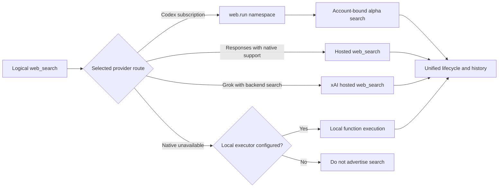

# Unified web search

fx exposes one logical `web_search` capability. Provider-specific wire formats and execution ownership remain behind the gateway boundary, so the agent harness, permission metadata, lifecycle rendering, ACP events, and child sessions do not grow parallel search tools.



## Routing contract

The tool registry owns the provider-neutral schema and product metadata. `src/core/gateway/web_search_projection.zig` is the single wire projection point:

* Codex subscription replaces the logical declaration with the reserved `web.run` namespace. fx executes those calls through the authenticated standalone search endpoint and preserves its search-session identity across search, open, click, and find operations.
* Direct Responses routes replace the logical function with `{"type":"web_search"}` when the resolved model capabilities permit native search.
* Grok applies the same hosted declaration only when the authenticated model catalog reports `supportsBackendSearch` or `supports_backend_search`. This matches Grok's provider-owned capability boundary.
* A provider bundle may attach the configured Responses executor. It is selected only when native search is unavailable. Without either route, `web_search` is omitted from the effective tool projection.

Projection rejects duplicate local and native declarations. This prevents a model from seeing two search tools or a provider request from accidentally running both routes.

## Lifecycle and replay

Provider-hosted Responses events are normalized into `provider_tool_started` and `provider_tool_completed`. The ordinary tool-lifecycle publisher then owns the visible `Searching web` and `Searched web` rows for TUI, ACP, noninteractive CLI, and child sessions. Gateway callbacks only emit events; UI-owned transcript state still mutates on the UI thread.

Completed hosted `web_search_call` output items remain in provider state and are replayed in later Responses input. Grok therefore receives the same search evidence that its own client preserves, while local function search continues through the normal function-call result path.

## Availability and fallback

Search is available when either the resolved model supports its provider's native route or the selected provider bundle has a configured local executor. The model catalog is authoritative once loaded. Optimistic fallback capabilities cover startup before a catalog is available, but an explicit catalog denial removes the native tool.

The local fallback follows Grok Build's separately configured Responses search client. Set both of these variables to enable it:

```bash
export FX_WEB_SEARCH_API_KEY="your-search-provider-key"
export FX_WEB_SEARCH_MODEL="a-model-with-hosted-web-search"
```

It calls OpenAI's Responses base by default. Set `FX_WEB_SEARCH_BASE_URL` to use another Responses-compatible base URL; fx appends `/responses` when needed. These values are independent of the active conversation credential, so switching between BYOK, Codex, and Grok cannot redirect a child turn or leak a subscription token into the fallback provider.

Fallback is a route decision, not an automatic retry of a partially delivered provider request. Once a hosted request may have executed, fx does not silently issue a second search through another backend because that could duplicate billable or stateful work.
